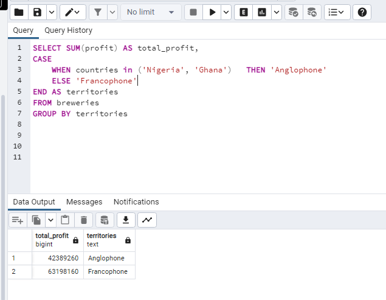
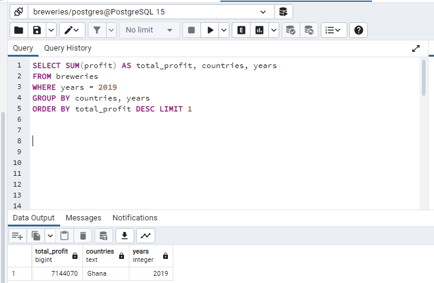
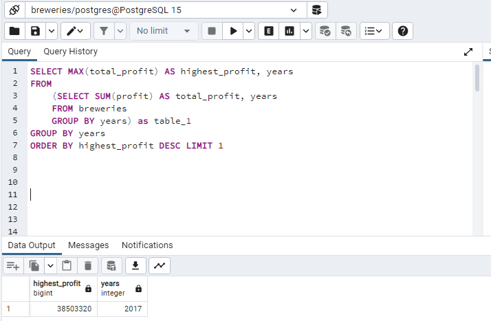
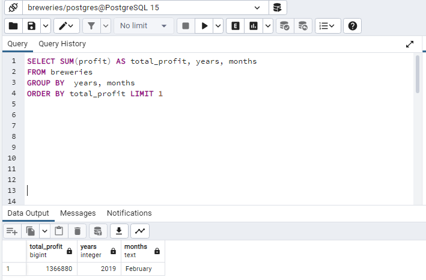

**BREWERY PROJECT**

**INTRODUCTION**
In this project, I will be using SQL to query the database of an organization to perform a profit and brand analysis of their products

**PROBLEM STATEMENT**

A brewery company is planning for the next five years and seeks to know ways through which they can maximize profit and reduce their losses. In a bid to access the profitability of the business, I will be querying the sales record of the company between 2018-2020.

**PROFIT ANALYSIS**

In the space of three years under review, the Territory Manager of the organization will like to know which region and country generated the highest and lowest income in order to know what measures to put in place in order to maximize profit in the years ahead.
The following queries will give insights that will help him/her make the right decisions:

1. What region generated the highest profit?

2. Which country generated the highest profit in 2019?

3. Within the three years under review, in what year was the highest profit generated?

4. In all the three years under review, in which month was the least profit generated?
 

5. What was the minimum profit in the month of December 2018?
7. Compare the profit in percentage for each of the month in 2019
8. Which particular brand generated the highest profit in Senegal?

1. What are the top three brands consumed in the francophone countries?
3. What are the top two choice of consumer brands in Ghana?
4. What beers are consumed in the past three years in the most oil rich country in West Africa(Nigeria)?
5. What is the favorite malt brand in the Anglophone region between 2018 and 2019?
6. Which brands sold the highest in 2019 in Nigeria?
7. What is the favourite brand in South_South region in Nigeria?
8. What beers are consumed in Nigeria?
9. Which region in Nigeria consumed the highest proportion of budweiser?
10. Which region in Nigeria consumed the highest proportion of budweiser in 2019?

