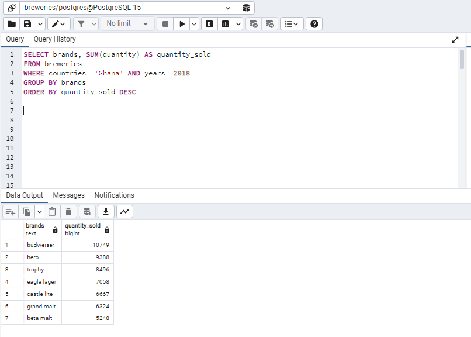

**BREWERY PROJECT**
-------------------------

**INTRODUCTION**
---------------------------------

In this project, I will be using SQL to query the database of an organization to perform a profit and brand analysis of their products

**PROBLEM STATEMENT**
---------------------------------------

A brewery company is planning for the next year (2020) and seeks to know ways through which they can maximize profit and reduce their losses. In a bid to access the profitability of the business, I will be querying the sales record of the company between 2017-2019.

**PROFIT ANALYSIS**
------------------------------------------------------

In the space of three years under review, the Territory Manager of the organization will like to know which region and country generated the highest and lowest income in order to know what measures to put in place in order to maximize profit in the years ahead.
The following queries will give insights that will help him/her make the right decisions:

1. What region generated the highest profit?

   

   _The francophone region generated more profit than the anglophone region_

2. Which countries generated the highest profit in the three years under review?
  
  
                                             Top 3 Countries in 2017                 
    
   
         
                                             Top 3 Countries in 2018                 
   
    
   
   
                                             Top 3 Countries in 2019                 
   
   
   
   
   _In 2017 and 2018, sales made in Nigeria generated the highest profit among the countries where the company's products were sold in the anglophone and   francophone region. However, in 2019, Ghana had the highest profit_
 

3. Within the three years under review, in what year was the highest profit generated?

   
  
   _In all the three years under review, the highest income was generated in 2017 while the least income was generated in 2019. This implies that sales has dwindled over the years_

4. Since it has been established that the least profit was generated in 2019, I will like to dive into the profit generated in 2019 and ascertain the percentage profit for each month. What is the profit in percentage for each month in 2019?

   
   
   _In 2019, the highest income was generated in January while the least profit was generated in February_

  
5. I will like to compare if the trend of sales by months in 2017 and 2018 are the same as that of 2019. So what is the profit in percentage for each month in 2017 and 2018?

   2017                                               |     2018
   :-------------------------------------------------:|:--------------------------------------------------------------------:
                              |    
   
   _The profit trend by months in both 2017 and 2018 differs from that of 2019. In 2017 and 2018, the highest profit was generated in May and February while the least profit was realized in June and May respectively._
   
 **Conclusion on Profit Analysis**
 -------------------------------------------------------------------------
•	The francophone region generated more profit than the anglophone region

•	The profit generated by sales of the company's products had the highest value in Nigeria in both 2017 and 2018 while the highest profit was generated in Ghana in 2019.

•  Sales dropped considerably in Nigeria in 2019. As a result, the overall profit margin of the company reduced in 2019 compared to the other two years

•	The profit trend by months for all the years differs

**BRAND ANALYSIS**
----------------------------------------------------------------------
To have a better understanding of the sales trend by months and find a possible reason(s) why the total profit for 2019 was lower than the other years, I will do an analysis of the various brands of malt and beer produced by the company with the following queries:

1. What are the top three brands consumed in the francophone and anglophone countries in 2017 and 2019?

   FRANCOPHONE REGION (2017)                          |     FRANCOPHONE REGION (2019)
   :-------------------------------------------------:|:--------------------------------------------------------------------:
                             |    
   
    ANGLOPHONE REGION (2017)                          |     ANGLOPHONE REGION (2019)
   :-------------------------------------------------:|:--------------------------------------------------------------------:
                              |    
   
   _The top three brands for both years differ for both regions._
   
 2. What are brands consumed in Nigeria and Ghana in 2017 and 2019?
 
    GOODS SOLD IN GHANA IN 2017                       |     GOODS SOLD IN NIGERIA IN 2017
   :-------------------------------------------------:|:--------------------------------------------------------------------:
                                   |    
   
   
   
   
    GOODS SOLD IN GHANA IN 2018                       |     GOODS SOLD IN NIGERIA IN 2018
   :-------------------------------------------------:|:--------------------------------------------------------------------:
                                   |    
   
   
   
    GOODS SOLD IN GHANA IN 2019                       |     GOODS SOLD IN NIGERIA IN 2019
   :-------------------------------------------------:|:--------------------------------------------------------------------:
                                   |    
 

3. Which brands were most consumed in Nigeria and Ghana in 2017 and 2019?
4. What beers are consumed in the past three years in the most oil rich country in West Africa(Nigeria)?
5. What is the favorite malt brand in the Anglophone region between 2018 and 2019?
6. Which brands sold the highest in 2019 in Nigeria?
7. What is the favourite brand in South_South region in Nigeria?
8. What beers are consumed in Nigeria?
9. Which region in Nigeria consumed the highest proportion of budweiser?
10. Which region in Nigeria consumed the highest proportion of budweiser in 2019?

